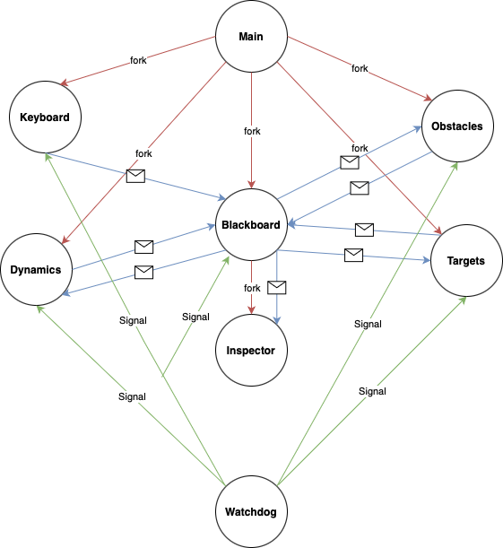

# Assignment 1: Drone Game
This assignment has been tested on **Ubuntu 24.04** running on an **AMD processor**, with **C 17** and **CMake 3.28**. Follow the instructions below to set up and run the project.

## Requirements

To compile and run the project, the following dependencies must be installed:

- `ncurses` (for terminal handling)
- `CMake` (for build configuration)

### Installing Dependencies

If you don't have `CMake` or `ncurses` installed, follow these steps:

1. **Update your package list**:
   ```bash
   sudo apt update
   ```

2. **Install `CMake` and `ncurses`**:
   ```bash
   sudo apt install cmake libncurses5-dev
   ```

## Building the Project

### Step 1: Create a build directory

Navigate to your workspace and create a new directory for building the project.

```bash
mkdir cmake-build && cd cmake-build
```

### Step 2: Configure the project with CMake

Run the following command to configure the project:

```bash
cmake ..
```

### Step 3: Compile the project

Once the configuration is complete, run `make` to compile the project:

```bash
make
```

## Running the Game

Once the project is successfully built, you can run the game with the following command:

```bash
./DroneGame
```

## Project scheme
